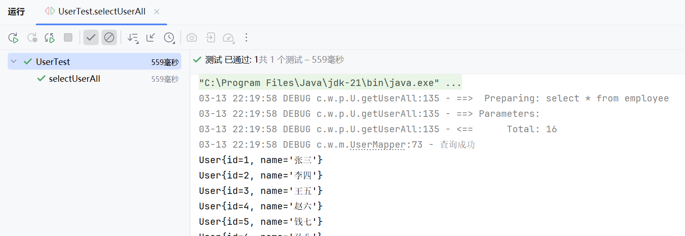
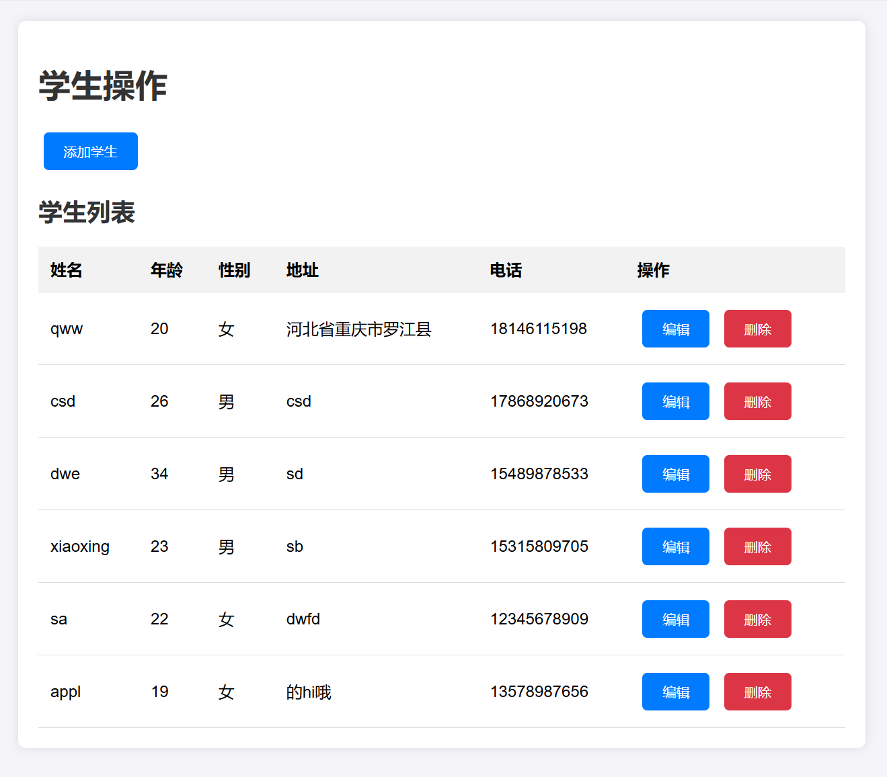

# 课程实验与源码分享spring+mybatis

## 注意事项
- **禁止复制！**
- **出现任何问题概不负责**

## 实验项目：my_learning

### 目录结构
- **java/**  
  源代码目录，包含所有Java源代码文件。

- **java/resources/**  
  资源目录，存放配置文件、静态资源等。

- **test/**  
  测试目录，包含单元测试和其他测试脚本。

### 使用依赖
- **Lombok**  
  减少样板代码，提升开发效率。

- **MySQL**  
  数据库管理系统，用于数据存储和管理。

- **JUnit**  
  单元测试框架，帮助验证代码的正确性。

- **MyBatis**  
  持久层框架，简化数据库操作。

- **logback**
  日志框架，用于记录应用程序的运行日志。
- **slf4j**
  日志门面，提供统一的日志接口。

### 实例
- **UserTest.java**
  

## 实验项目：学生信息操作

### 目录结构
- **config**  
  配置文件目录，包含应用程序的配置信息。

- **controller**  
  数据请求接受器，处理用户请求并返回响应。

- **mapper**  
  数据库操作映射器，用于与数据库进行交互。
- **pojo**  
  实体类
- **service**  
  逻辑处理器，负责业务逻辑的实现。

- **templates**  
  数据动态网页模板，用于生成动态网页。

### 使用依赖
- **Lombok**  
  减少样板代码，提升开发效率。

- **MySQL**  
  数据库管理系统，用于数据存储和管理。

- **MyBatis**  
  持久层框架，简化数据库操作。

- **logback**
  日志框架，用于记录应用程序的运行日志。
- **slf4j**
  日志门面，提供统一的日志接口。
- **vue**  
  动态页面框架，用于生成动态网页。
- **axios**  
  用于浏览器和Node.js中发起AJAX请求，方便前后端数据交互。
- **web**  
  实现网络请求，用于与服务器进行通信。
### 实例
- **效果图**
  